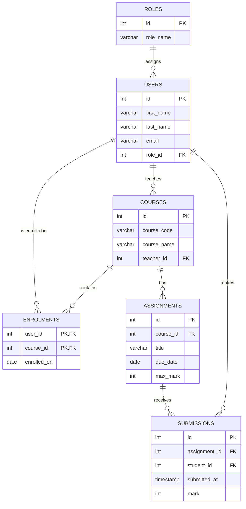

```mermaid
erDiagram
    ROLES ||--o{ USERS : "assigns"
    USERS ||--o{ COURSES : "teaches"
    USERS ||--o{ ENROLMENTS : "is enrolled in"
    COURSES ||--o{ ENROLMENTS : "contains"
    COURSES ||--o{ ASSIGNMENTS : "has"
    ASSIGNMENTS ||--o{ SUBMISSIONS : "receives"
    USERS ||--o{ SUBMISSIONS : "makes"

    ROLES {
        int id PK
        varchar role_name
    }

    USERS {
        int id PK
        varchar first_name
        varchar last_name
        varchar email
        int role_id FK
    }

    COURSES {
        int id PK
        varchar course_code
        varchar course_name
        int teacher_id FK
    }

    ENROLMENTS {
        int user_id PK, FK
        int course_id PK, FK
        date enrolled_on
    }

    ASSIGNMENTS {
        int id PK
        int course_id FK
        varchar title
        date due_date
        int max_mark
    }

    SUBMISSIONS {
        int id PK
        int assignment_id FK
        int student_id FK
        timestamp submitted_at
        int mark
    }
```