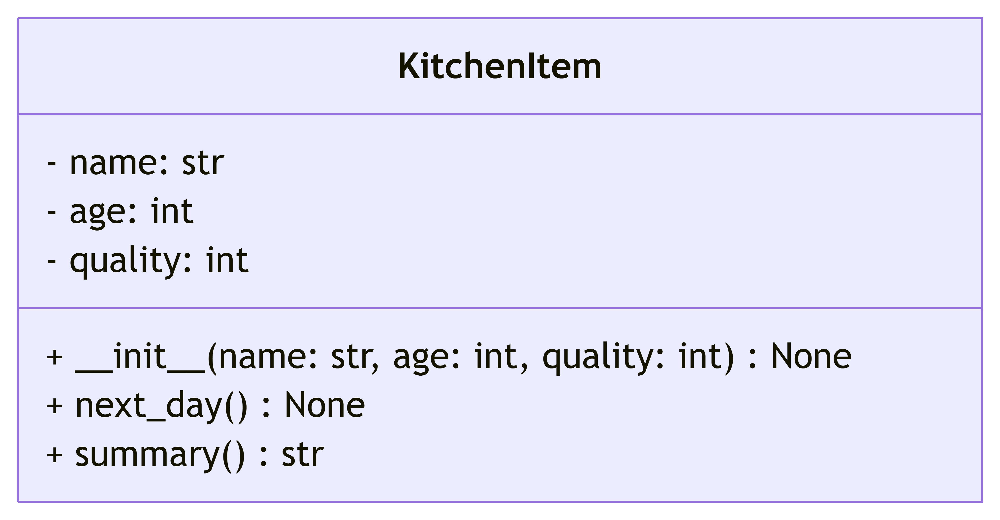

# Kitchen Item



## Key information
- Always ages by 1
- quality decreases by 4

```py
# Example usage of KitchenItem class

# Create an instance of KitchenItem
item = KitchenItem(name="Apple", age=1, quality=10)

# Print initial summary
print(item.summary())  # Output: Apple: age: 1, quality: 10

# Simulate next day
item.next_day()

# Print updated summary
print(item.summary())  # Output: Apple: age: 2, quality: 6
```

# Living Room Item
## Key information
- Always ages by 1
- quality decreases by 1

# Bedroom Item
## Key information
- Always ages by 1
- quality decreases by 2